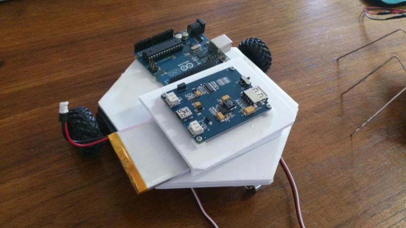
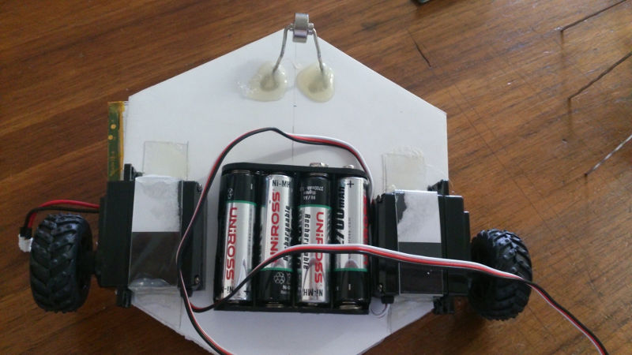
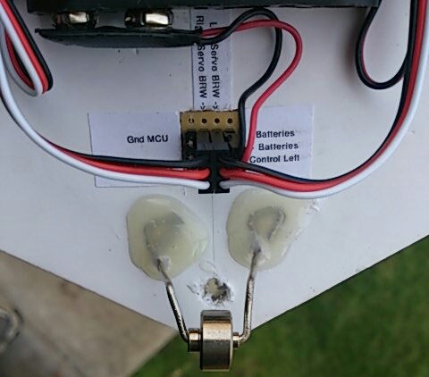
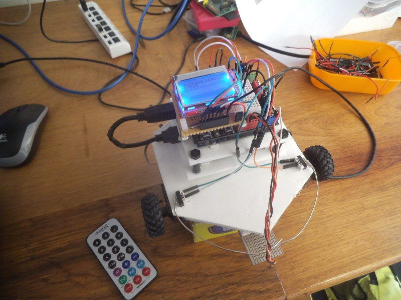
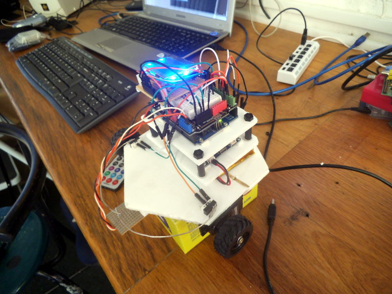

FoamBot
=======

This is a project to build a simple bot using [Foam Board][1] as the
construction basis.

Features
--------
Two continuous rotation servos are used for the drive train and for now an
Arduino Uno is used as the controller.

Power for the servos is from 4 x AA batteries while the Arduino is powered from
a LiPo battery via [LiPo Rider Pro][2].

Bot control at the moment consists of:
* Remote control using an IR receiver and cheap IR remote control from a car FM
  audio transmitter.
* Line follower using two TCTR5000 IR sensors - still needs some tweaking.

Software - TODO: details to be added, but see the code...

Components
----------
The various hardware and software components making up the bot is described
below.

### Base and Structure ###
Foam board, hexagon??

### Power supply ###
4 x AA for servos, LiPo for MCu, LiPo Rider for charging and DC-DC step-up and
stable supply... Also provides pass through for USB programming...

### Drive train ###
Continuous rotation servos, Arduino `Servo` library, see movement controls...

### IR Receiver ###
TSOP???? IR Receiver, Multi Proto ???
http://arcfn.com/2009/08/multi-protocol-infrared-remote-library.htm

### LCD ###
Nokia 5110/PCD8544, "Fast PCD8544 Library", http://forum.arduino.cc/index.php?topic=176794.0

Current status
--------------
At the moment it is difficult to tweak the line following functionality since
the bot needs to be tethered to the laptop via USB cable to see the sensor
readings and current movement state. In order to make debugging this easier an
LCD display is being added.

The LCD being used is one of the Nokia 5110 / PCD8544 displays easily found all
over. There are some variations in these modules with different pin outs although
the modules looks very similar. More details to follow.

Pics
----
Some images:

Top view with only place for the LiPo battery and the [LiPo Rider][2] mounted.
The battery compartment and LiPo Rider platform was all done in minutes using
[Foam Board][1] and a glue gun!

-----

This is the bottom view with servos and battery box mounted. The base consists
of two layers of Foam Board stuck together, with the servos recessed into the
base by cutting out a shape for them in the bottom of the two pieces of Foam
Board. This way the servos fit snug with no lateral movement. They are kept in
place by some plastic "brackets" cut and folded to fit over them which are then
glued to the base. I did not glue the servos to the base since I may want to use
them again in some other project. The battery box is glued to the base however.

The rear wheel is made from a little metal wheel from an old hard drive and a
paper clip which is then glued to the base. This is not such a good arrangement
since, although the wheel is very smooth and the edges are rounded, it still
gets stuck occasionally when the bot makes a tight turn. This will be replaced
with a castor wheel or ball wheel later.

-----

The servo power distribution and connections to the Arduino all run to a little
home made connector block mounted in the bottom of the base between the battery
box and rear wheel. The connector block is simply a piece of [veroboard][3]
with a total of 12 headers (4x3) soldered on for the two 3-pin servo plugs,
ground and servo control pins from the Arduino, and the battery supply plug. The
veroboard is soldered to distribute the power to the servos, connect the
micro controller ground to the battery ground, and connect the servo control
wires from the micro controller to the servos.

The hole in the middle of the back wheel is where the servo control and ground
wires from the micro controller will come through.

-----

This image shows the current state of the bot. Another platform has been added
above the [Lipo Rider][2] platform. This platform is where the Arduino is
mounted and it stands on risers cut from 8mm irrigation pipe used in for micro
sprinklers.

The risers are glued to the bottom platform, but the top platform is screwed
onto the riser pipes using screw in plugs used in the irrigation systems as
block off plugs.

A [DF Robot Prototyping Shield][4] is plugged into the Arduino. This gives lots
of ground and power headers and also a small breadboard and some LEDs and a
button for easy prototyping.

The TCTR5000 IR receiver is just barely visible in the top right of the
breadboard behind all the wires. The IR transmitter that I use is lying next to
the bot on the table.

The latest addition to the bot, the LCD, can also be seen here. This LCD is
plugged into a little home made board containing a CD4050 level shifter for
converting the Arduino 5V signals to 3V3 for the LCD. At the moment the LCD only
gets updated with the string "Testing LCD..." and the current uptime (millis)
every _refresh_ period. The next step is to continuously update the display with
the current bot state.

The TCTR5000 sensor board can be seen mounted on the front as well as two front
facing bumpers. The IR sensor board is used for line following, but this is just
a sample as proof of concept borrowed from another project where it was used as
a rotation counter. Once the line following code has been completed a new sensor
board will be built that will fit and look better.

-----

Another view from the left which gives a clearer indication of the component
stack.

[1]: http://en.wikipedia.org/wiki/Foamcore
[2]: http://www.seeedstudio.com/wiki/index.php?title=Lipo_Rider_Pro
[3]: http://en.wikipedia.org/wiki/Veroboard
[4]: http://www.dfrobot.com/wiki/index.php/Prototyping_Shield_For_Arduino_%28SKU:_DFR0019%29
